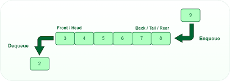

# Queue

## Introduction to the Queue data structure
A queue is a data structure that follows the First In First Out manner. This is just like the lines we are all used to being in for things like the store, to buy a ticket, or to even take your turn at the drinking fountain.

There is a person in the 'Front' of the queue and then another person lines up behind him and so forth. When the person in front is served that is called a **Dequeue** and when someone goes into the line that is called **Enqueue**. A queue will also have functions to tell if it is **Empty** or the **Size** of the queue.




## How to write a Queues Example:
This is an example of how to write a queue. Keep in mind that the dequeue() can be different depending on how you want to return the item. for example a Priority queue will dequeue with checking the queue is empty then use loops and if statements to find the higher priority items.

```python
class Queue:
  def __init__(self):
    self.queue = [] # start with empty Queue

  def enqueue(self, value):
    self.queue.append(value) # Be sure to use .append() and not .insert or you will start making a Stack (a different data structure)

  def dequeue(self):
    #In a Priority queue you will do logic to make sure the high priorities are returned first.
    value = self.queue[0] # Get the value of the first item
    del self.queue[0] # Get rid of first item
    return value # return that value (Remember this is a FIFO type)

  def is_Empty(self):
    return len(self.queue) == 0

  def __len__(self):
    return len(self.queue)

# Node is necessary to create the actual items
class Node:
      def __init__(self, value, priority):
        self.value = value
        self.priority = priority
```

With this basic queue implementation you can write all sorts of different types of queues such as a **Turn Taking**, a **Priority**, or just a regular queue. **Priority queue** has a O(1) looking up and removing the first item and a O(n) for inserting an item in the queue.

## Queue Assignment:
Your job is to prioritize error messages for the upgrades to the packing machine for the pet food factory you work for. You will have CRITCAL (3), IMPORTANT (2), and INFORMATION(1). You need to make the errors that have the highest priority to display first then those with lower priorities. If there are multiple items with the same priority the first one that is enqueued will be dequeued first. You will have a "Sensor 1 Blocked at CRITCAL", a "Front gate open IMPORTANT", "packing complete INFORMATION", and at least 1 other error message the either CRITCAL or IMPORTANT.

###SOLUTION TO Assignment:
[Solution](SolutionQueue.md)
