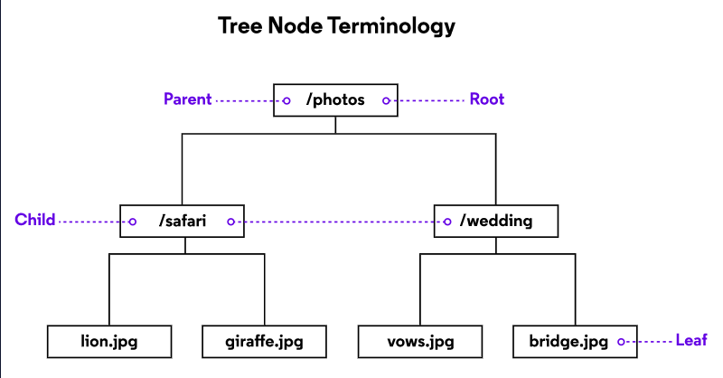

# Trees
A **Tree** is much like a Linked List in that it contains nodes as well. A tree can connect to multiple nodes, where as a Linked list only connects to one other node.

**Binary Trees** ore a Binary Search Tree (BST) are trees that connect only up to two nodes. The top node is called the **root** and the nodes at the end are with no other nodes after them are called the **leaves**

Starting from the root you can travers down either left or right. Nodes to the left are a smaller value than the nodes to the right.

One good example of a tree is a heiracacle file system such as below.



The picture above shows the root and leaf but also shows a couple other terms. A **Parent** which is a node that has connecting nodes. Also the **Child** which is a node that is connected to a parent node.

## Implementation
Now that we learned about the structure of a Tree lets talk about how to Implement one.

### Construction
```python
class Node:
  def __init__(self, data):
    self.data = data
    self.left = None
    self.right = None

class BST:
  def __init(self):
    self.root = None

  def insert(sef, data):
    pass
  def _insert(self, data, node):
    pass
  def __contains__(self, data):
    pass
  def _contains(self, data, node):
    pass
  def __iter__(self):
    pass
  def _traverse_forward(self, node):
    pass
```
Those are the basic functions of a tree and I will go over each one in this tutorial here is a table describing the efficiency of the different functions. Some of these functions will only be as efficent because of the use of something called **Recursion** which is a function that calls it self. Recursion needs to follow some rules or else there will be stack overflows. first rule is the **Base case** which is the scenario in which the recursion is no longer required. second and rule is **Make the problem smaller**, we need to shrink the problem down each time to prevent the stack overflow.

function | describtion | efficiency
-------- | -------- | --------
insert(data) | insert a value into the tree | using recursion O(log n)
contains(data) | checks to see if the value(data) is in the tree | using recurions O(log n)
remove(data)  | removes a node | using recursion O(log n)
traverse_forward(node)| start at root and travers through the whole tree | O(n)

### BST functions
* inserting we will have two one for no nodes and one to use recursion to insert the node in the right place.
```python
def insert(sef, data):
  if self.root is None:
    self.root = BST.Node(data)
  else:
    self._insert(data, self.root)
def _insert(self, data, node):
  if data < node.data:
    if node.left is None:
      node.left = BST.Node(data)
    else:
      self._insert(data, node.left) # recurion
  elif data > node.data:
    if node.right is None:
      node.right = BST.Node(data)
    else:
      self._insert(data, node.right)
```
* a contains function will return true or false if the value is in the tree.
```python
def __contains__(self, data):
    return self._contains(data, self.root)
def _contains(self, data, node):
  if data > node.data and node.right:
    return self._contains(data, node.right)
  elif data < node.data and node.left:
    return self._contains(data, node.left)
  if data == node.data:
    return True
  else:
    return False
```

* to traverse we need an __iter__ to make the tree iterable
```python
def __iter__(self):
    yield from self._traverse_forward(self.root)
def _traverse_forward(self, node):
    if node is not None:
      yield from self._traverse_forward(node.left)
      yield node.data
      yield form self._traverse_forward(node.right)
```

## Problem
A binary search tree would be usless if we can't delete from it. I will give some hints, however your job is to make a delete fucntion for the BST. It will need to have a leaste this code:
```python
def find(self, data):
    if self.root != None:
        return self._find(data, self.root)
    else:
        return None
def _find(self, data, cur_node):
    if data == cur_node.data:
        return cur_node
    elif data < cur_node.data and cur_node.left != None:
        return self._find(data, cur_node.left)
    elif data > cur_node.data and cur_node.right != None:
        return self._find(data, cur_node.right)
def delete_value(self, data):
    return self.delete_node(self.find(data))
```
Your job will be to see if you can implement the self.delete_node(). ANother hint for code you will need also these helper methods
```python
def min_value_node(n):
    current = n
    while current.left != None:
        current= current.left
    return current
def num_children(n):
    num_children = 0
    if n.left != None: num_children += 1
    if n.right != None: num_children += 1
    return num_children
```
[Solution](treeSolution.md)
